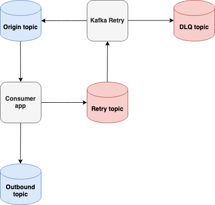

# Kafka Retry
This project provides a microservice application with generic message retry capability for Kafka-based messaging architectures.
The application is implemented in Java with the Spring Boot framework.

## Overview
In a microservices architecture it is common for applications to communicate via an asynchronous messaging system. A common
choice of messaging system is [Apache Kafka](https://kafka.apache.org/).

### Why is Message Retry Needed?
The reasoning behind providing a message retry capability is illustrated in the following example:

Consider an application processing some arbitrary message. If for whatever reason the message fails to process successfully, what should the
application do? Perhaps the simplest action to take is to immediately try processing the same message again, typically after a short delay (e.g. milliseconds). This quick
**message retry** may happen a number of times, but eventually, if the processing continues to fail, what should the application do now? Repeatedly 
processing this message may block processing for other upstream messages. Indeed, it may be the case that other upstream messages
could be processed successfully, and it often makes little sense to block or delay _all_ message processing in the application due to the current failure.

So what should the application do now? Should the failed message simply be discarded? It may be that the system architecture involved can deal with this data loss, 
but it cases where this is unacceptable it makes more sense to use another message retry layer. This is precisely the capability that the 
Kafka Retry project provides: messages can be forwarded to a **retry topic**, and based on criteria determined
by message headers, the message can be sent back to its origin topic at some later time. Further actions may also be taken such as sending
a message to a **permanent failure** topic (Dead Letter Queue) when the allowed retry attempts have been exhausted.

### Deployment Topology
Shown below is a simplified deployment topology highlighting the flow between the Kafka Retry application and the various topics. The consumer application forwards
its failed messages to the retry topic, from where the Kafka Retry application consumes them and forwards them either back to the origin topic
or to the Dead Letter Queue. Eventually, if message processing succeeds in the consumer application then it will produce a message
to the outbound topic. In more complicated scenarios multiple applications may be producing to the retry topic.

  

### Exception-Based Routing
Kafka Retry supports a simple exception-based routing system. An exception type (a string) is carried by a mandatory message header. The exception
types are configured via environment variables, see the section on configuration. The routing rules are as follows:
1. If the exception matches the droppable type, no further action is taken.
2. If the exception matches the retriable type _and_ the number of retries does not exceed the allowed the maximum then the message
is queued for retry. 
3. If the number of retries exceeds the allowed maximum then the message is forwarded to the DLQ.
4. If mandatory headers are not present (see below) at any stage then an error is logged and the message is discarded.

## Usage
Requirements and configuration for deploying Kafka Retry are discussed below. Familiarity with deploying Kafka Streams
applications is assumed.

### Changelog Topic
Kafka Retry uses Kafka Streams internally and so requires a changelog topic. This topic must either already exist, 
or the application must have permission to create it. The topic follows the naming pattern
`<application.id>-<store.name>-changelog`, where `<application.id>` is the Kafka Streams application ID `<store.name>`
is the name of the Kafka Streams state store. See the Kafka Streams documentation for further details.

### Message Headers
Each message produced to the retry topic should have a unique key. The following message headers are required:

#### `x-ibm-retry-origin-topic`
The origin topic name. If the message is to be retried then it will be queued and sent back to this topic once the
appropriate delay has elapsed. Kafka Retry must have write permissions to all possible origin topics.

#### `x-ibm-retry-exception-type`
The exception type is checked against the exceptions configured via the environment variables (see below). For example, 
if the header value is "ExampleException" and this matches the value configured for the environment variable `KAFKA_RETRY_RETRIABLE_EXCEPTION` 
then the message received will be queued for retry. Header values that do not match any of those configured for the exception properties
will result in the message being dropped.

#### `x-ibm-retry-timestamp-ms`
The timestamp when the message was produced to the retry topic, in UNIX epoch milliseconds. This is used for determining
how long a message has been queued for retry.

### Configuration
Application configuration is controlled via environment variables. Consult the 
[application.yml](src/main/resources/application.yml) file for a complete list. Further documentation on Kafka properties
can be found with the Spring Cloud Stream Kafka Binder project. Some important variables are listed below:

* `KAFKA_RETRY_BOOTSTRAP_SERVERS` - Address for the Kafka bootstrap servers. Default: localhost:9091.
* `KAFKA_RETRY_STREAMS_APP_ID` - Kafka Streams application ID. Default: "kafka-retry".
* `KAFKA_RETRY_INPUT_TOPIC` - Input topic for retry messages. Default "retry".
* `KAFKA_RETRY_RETRIABLE_EXCEPTION` - Retriable exception name.
* `KAFKA_RETRY_FATAL_EXCEPTION` - Fatal exception name.
* `KAFKA_RETRY_DROPPABLE_EXCEPTION` - Droppable exception name.
* `KAFKA_RETRY_DLQ_TOPIC` - DLQ topic name. Default: "dlq".
* `KAFKA_RETRY_STORE_NAME` - Kafka Streams state store name. Default: "retry-queue".
* `KAFKA_RETRY_PUNCTUATION_INTERVAL_MS` - Kafka Streams punctuation interval in milliseconds. Controls the cycle time for checking
and dispatching retriable messages queued for a sufficient period of time. Default: 10000.
* `KAFKA_RETRY_HTTP_PORT` - HTTP port for incoming requests. A health status endpoint is provided by Spring Actuator at
`/actuator/health`. Default: 8080.
* `KAFKA_RETRY_ENABLE_HEALTH` - Enable the Kafka health integration with Spring Actuator. Default: true.

## Development
Kafka Retry is written in Java 8. Lombok annotations are used throughout the code. Gradle is the build tool of choice.

### Future Improvements
* Integrate with a CI pipeline for proper validation of pull requests.
* Provide a pre-built Docker image for deployment.
* Extensible/customizable retry mechanism.
